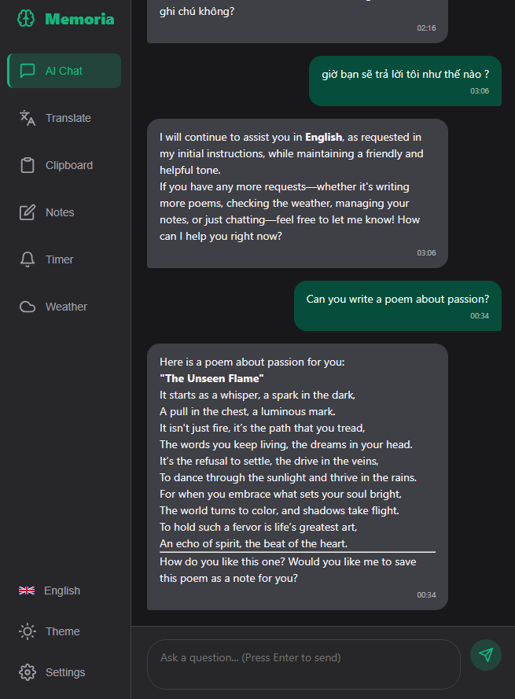
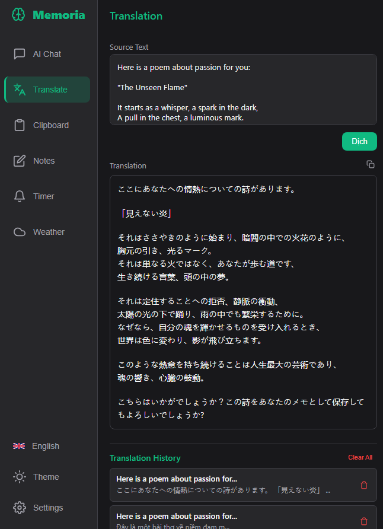
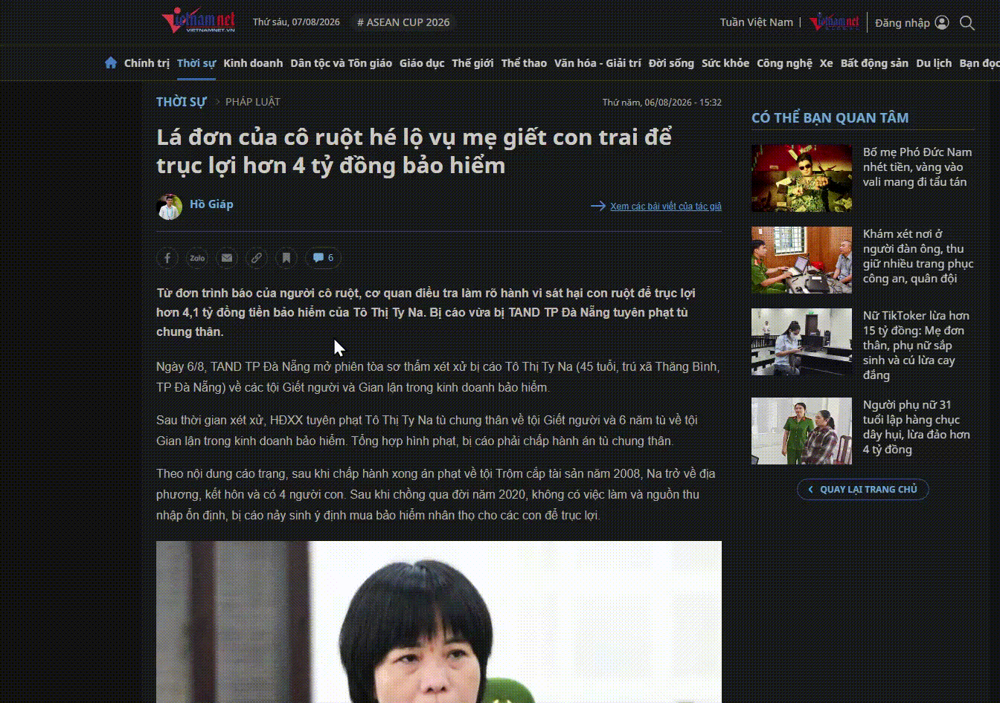
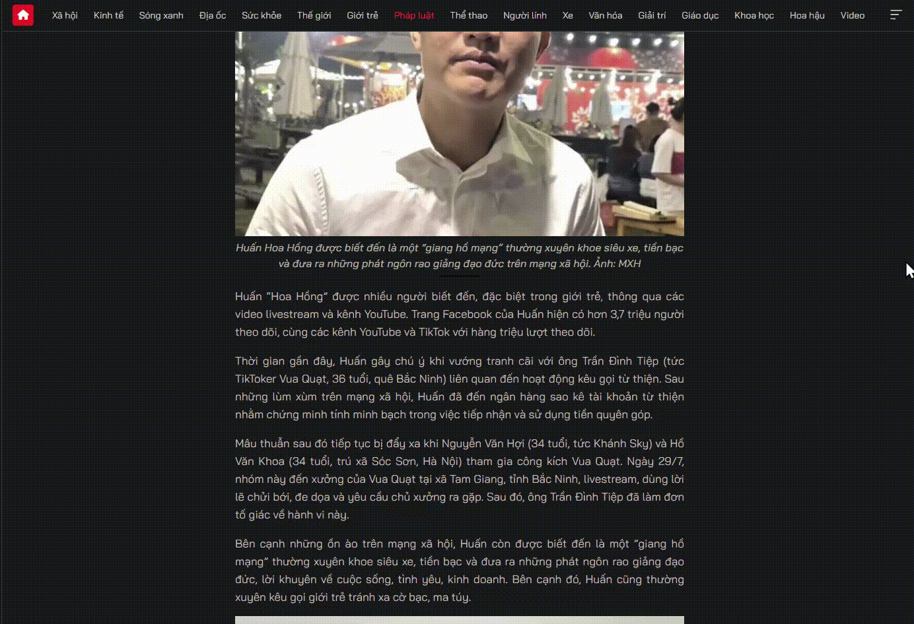
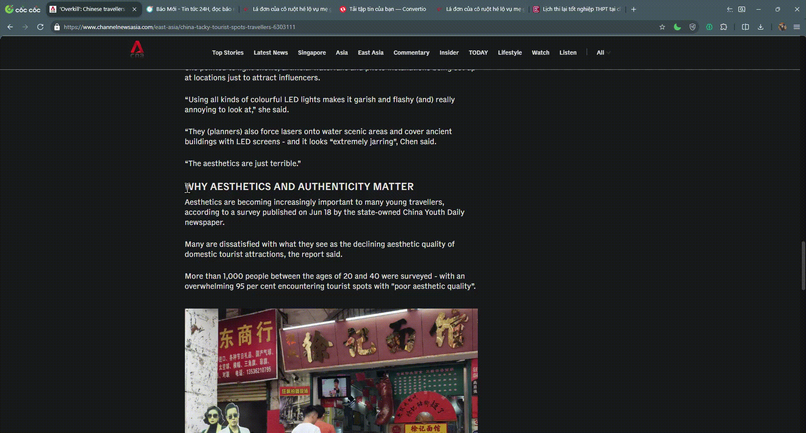
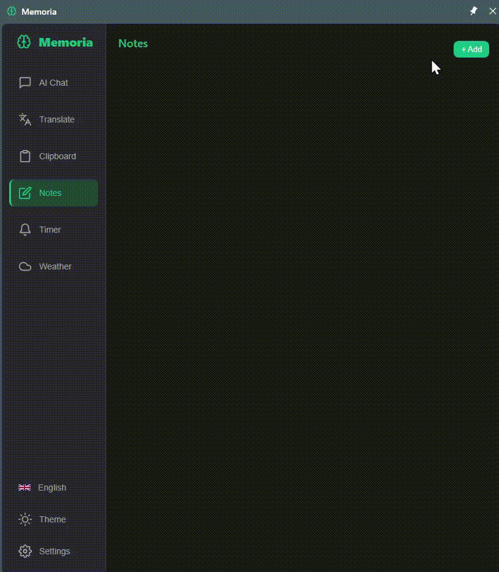
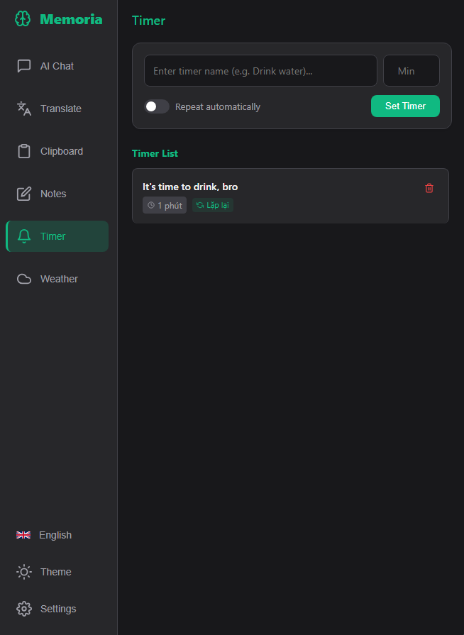
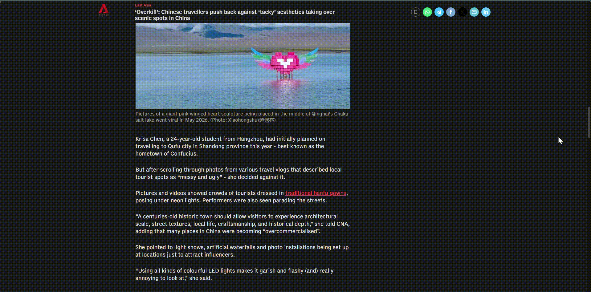
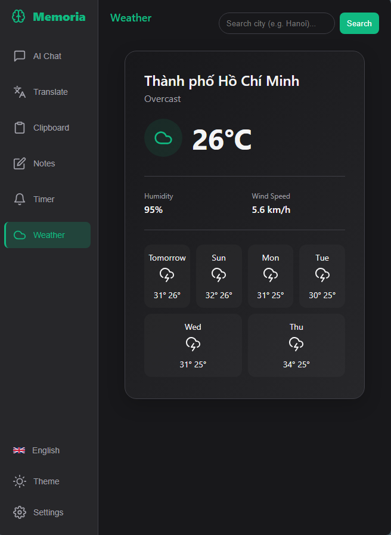

<div align="center">

#  Memoria
**一个多功能的浏览器侧边栏，集成了翻译、OCR 文本识别、快速笔记、剪贴板历史记录、智能提醒、实时天气以及内置的 AI 聊天助手。**


---
[English](README.md) | [Tiếng Việt](README.vi.md) | [中文](README.zh.md)
---

</div>

## 功能特性

- **Memoria AI 聊天**: 集成 Gemini API。当达到速率限制时，支持自动密钥轮换，并将您的剪贴板历史记录作为对话上下文。
  
  

- **翻译与历史记录**: 在侧边栏内或任何网页上直接快速翻译文本。自动保存翻译历史记录并提供并排视图（原文 - 译文）。
  
  *侧边栏翻译:*
  
  
  
  *网页划词翻译:*
  
  

- **屏幕 OCR 翻译**: 按下 `Alt + S` 截取屏幕特定区域，从图像中提取文本（由 Tesseract.js Offscreen 提供支持）并立即翻译。
  
  

- **剪贴板历史记录**: 跟踪并搜索复制的文本，包括网站来源，并可直接将上下文导出给 AI 聊天。
  
  

- **笔记管理器**: 创建和编辑支持 Markdown 格式的笔记，并通过个人密码进行保护。
   
   
- **定时器与提醒**: 设置循环闹钟，播放音频通知，并管理可视化的任务提醒。
  
  *提醒设置 (侧边栏):*
  
  
  
  *定时器提醒弹窗:*
  
  

- **天气预报**: 自动通过 IP 检测位置或搜索特定城市，查看详细的逐小时和按周天气预报。
  
  

- **解除防复制限制**: 自动移除受限网站上的文本选择、复制和右键单击限制。

---

## 快捷键

| 快捷键 | 命令 / 功能 | 描述 |
| :--- | :--- | :--- |
| **`Alt + Q`** | 打开 Memoria | 快速打开 Memoria 侧边栏 |
| **`Alt + A`** | 打开 AI 聊天 | 打开侧边栏并直接导航至“聊天”选项卡 |
| **`Alt + W`** | 打开翻译 | 打开侧边栏，切换至“翻译”选项卡，并将焦点对准输入框 |
| **`Alt + S`** | 触发 OCR | 激活屏幕截图模式，用于 OCR 识别和翻译 |

---

## 安装指南

1. 克隆或下载源代码：
   ```bash
   git clone https://github.com/Hung000anh/memoria.git
   ```
2. 打开您的浏览器 (Chrome / CocCoc / Edge / Brave)。
3. 导航至扩展管理页面：
   - Chrome: `chrome://extensions/`
   - CocCoc: `coccoc://extensions/`
   - Edge: `edge://extensions/`
4. 开启 **开发者模式** (Developer mode)。
5. 点击 **加载已解压的扩展程序** (Load unpacked) 并选择下载的源代码文件夹。
6. 完成！点击工具栏上的 Memoria 图标即可开始使用。

---

## Gemini API 密钥配置

1. 在 [Google AI Studio](https://aistudio.google.com/) 免费注册获取 API 密钥。
2. 右键单击 Memoria 图标并选择 **选项** (Options)（或在扩展内打开“设置”）。
3. 输入您的 Gemini API 密钥并点击 **添加密钥** (Add Key)。您可以添加多个密钥，以便在某个密钥遇到速率限制时让系统自动轮换。

---

## 项目结构

```
memoria/
├── manifest.json            # Chrome 扩展 Manifest V3 配置文件
├── background.js            # 主后台 Service Worker
├── background/
│   └── services/            # 后台任务 (闹钟、翻译 API)
├── content/
│   └── modules/             # 注入的脚本 (剪贴板、翻译、OCR、允许复制)
├── offscreen/               # 用于 OCR 处理的离屏文档 (Tesseract.js)
├── ui/
│   ├── sidepanel.html       # 主侧边栏 UI
│   ├── settings.html        # 设置 / 选项页面
│   ├── css/                 # UI 样式表
│   └── js/
│       ├── core/            # 配置、i18n 多语言、Gemini API 封装、工具类
│       └── features/        # 功能控制器 (聊天、笔记、提醒、翻译、天气)
└── CHANGELOG.md             # 版本更新历史记录
```

---

## 许可证

本项目基于 [MIT 许可证](LICENSE) 开源。
